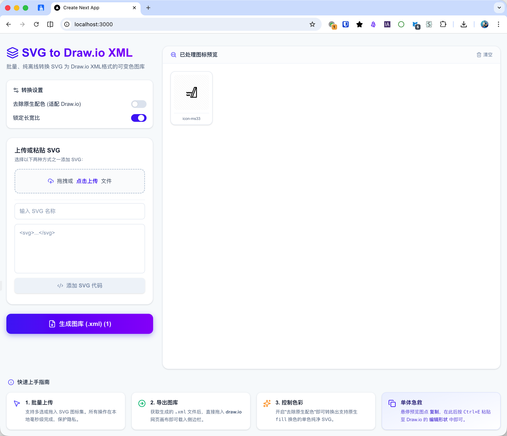

<div align="center">
  
  <h1>SVG to Draw.io XML</h1>
  <p>批量、纯离线转换 SVG 为 Draw.io XML 格式的可变色图库</p>
</div>



---
一款现代化的 Web 工具，基于 Next.js 开发，旨在将 SVG 图标完美转换为 draw.io (diagrams.net) 原生支持的可变色形状库 (.xml)，或一键提取单体剪贴板代码。

无论你是想要将设计工具中的图标库（如 Iconfont、Figma 导出的 SVG）批量整合为团队内部使用的 draw.io 资产，还是日常临时转换个别图标，本工具都能提供极速、安全、无缝的体验。

## ✨ 核心特性

- **🚀 极简交互，双重导入** 
  - 支持单文件或批量 SVG **拖拽/点击上传**。
  - 支持 **直接手动粘贴 SVG 代码**，适应快速跨应用（如从 VS Code 或设计工具中直接 C/V 代码）操作的场景。
- **🧹 智能清洗与去色**
  - 自动移除冗余标签和属性（例如 iconfont 的特有 class 或多余的全局外框）。
  - 支持一键 **去除原生配色**，从而在 draw.io 内部可以使用原生 Fill (填充色) 和 Stroke (描边色) 功能随意更改图标颜色。
  - 支持智能锁定图库元素的长宽比。
- **🎨 高保真路径解析**
  - 完整支持所有物理路径指令（`M`, `L`, `H`, `V`, `C`, `S`, `Q`, `T`, `A`）。
  - 完美兼容弧线与多阶贝塞尔曲线，保障图标在 draw.io 中的像素级还原。
- **📦 灵活的一键输出**
  - **下载标准图库**：一键生成经过 DEFLATE 压缩标准编码的 `.xml` 文件，这正是 draw.io 支持的原生侧边栏图库格式。
  - **单体急救粘贴**：支持在预览界面悬浮点击“复制”，随后在 draw.io 画布中按下 `Ctrl+E`（编辑形状）并直接粘贴 XML 代码。
- **🔒 绝对的隐私安全**
  - **纯纯的静态离线工具**，100% 在本地浏览器计算与转换。
  - 你的 SVG 数据永远不会被上传到任何后台服务器，无惧保密项目图标泄漏。

## 🛠️ 技术栈与依赖

- **前端架构**: Next.js (App Router) + React + TypeScript
- **UI 设计与样式**: Tailwind CSS + Lucide Icons (图标)
- **核心算法依赖**: 
  - [`pako`](https://www.npmjs.com/package/pako) (处理向 xml 格式封装时的 DEFLATE 压缩与 base64 编码)
  - [`svg-path-parser`](https://www.npmjs.com/package/svg-path-parser) (进行 SVG 路径的 AST 取树与解析)
  - 浏览器的原生 `DOMParser` 用于安全的 HTML/XML 节点遍历和清理。

## 🚀 部署指南

### 本地开发运行

```bash
# 1. 安装依赖
npm install

# 2. 启动本地开发服务器
npm run dev

# 3. 浏览器访问 http://localhost:3000
```

### Docker 容器部署 (推荐)

我们提供了多阶段构建的 `Dockerfile`，构建出的镜像极小且已在生产环境级别优化。

**使用 Docker Compose 快速启动**:
```bash
docker-compose up -d
```
启动后即可通过 `http://localhost:3000` 访问服务。

### QNAP NAS 部署 (Container Station)

为了方便在 QNAP NAS 设备上纯离线部署，本项目支持一键封包导出为针对不同 CPU 架构（如 Intel/AMD 或 ARM）的离线 Docker 镜像。

#### 1. 打包离线镜像文件
在你的电脑控制台根目录下运行封包脚本：
```bash
# 修改权限（首次运行）
chmod +x build-for-qnap.sh

# 为主流 Intel Core / AMD64 架构 NAS 编译打包
./build-for-qnap.sh linux/amd64

# (可选) 为 ARM 架构 NAS 编译打包
# ./build-for-qnap.sh linux/arm64
```
等待编译完成后，你会在项目目录中得到一个 `svg-to-drawio-image-0.1.0.tar` 文件。

#### 2. 在 NAS 导入并运行
1. 打开 QNAP NAS 的 **Container Station (容器工作站)**。
2. 左侧菜单点击 **“映像 (Images)”** -> 右上角 **“导入 (Import)”**，上传刚才生成的 `.tar` 文件。
3. 导入完成后，左侧点击 **“应用程序 (Applications)”** -> 右上角 **“创建 (Create)”**。
4. 将本项目下的 `docker-compose.prod.yml` 文件内容完全粘贴进去（如有端口冲突请自行修改映射）。
5. 验证并创建后，打开游览器访问 `http://<NAS_IP>:3000` 即可使用。

## 📜 鸣谢与参考资料

本项目的核心转换逻辑与图形学算法在开发过程中参考了以下开源库与规范：

- 核心算法启发: [mmunozba/svgtodrawio](https://github.com/mmunozba/svgtodrawio)
- 压缩逻辑解析: [mxlibrary 协议解析](https://blog.csdn.net/tiger9991/article/details/143184081)
- 官方图库标准规范: [Draw.io Stencil Specs](https://github.com/jgraph/drawio-libs)

## ⚖️ 开源协议

本项目基于 **MIT** 协议开源。你可以自由地使用、修改和分发，但也请保留原作者的版权声明。
